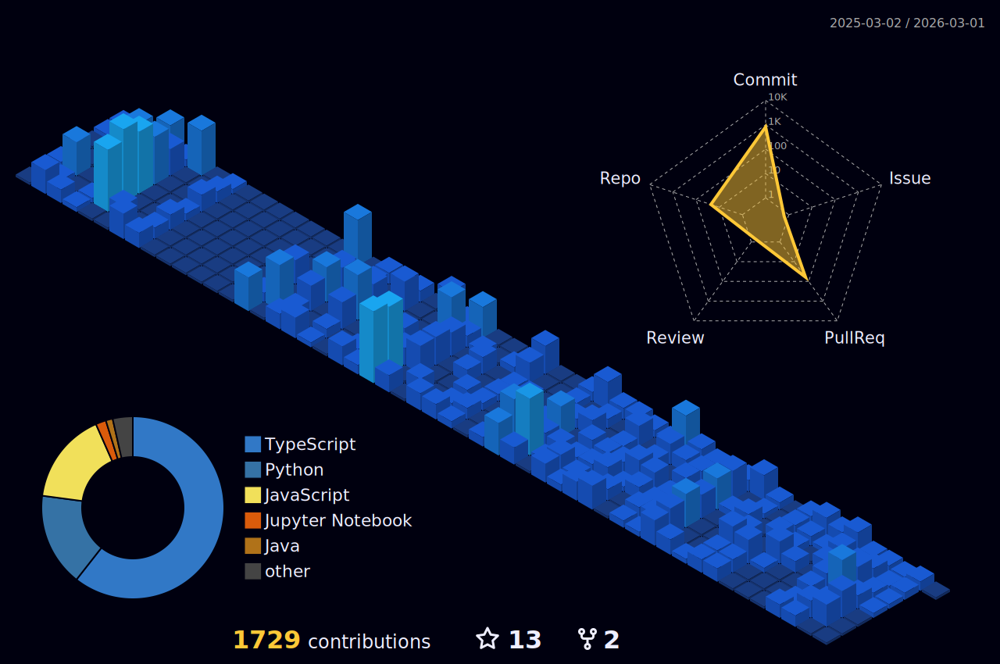
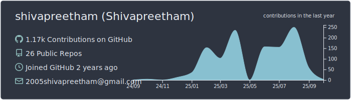
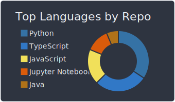
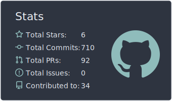
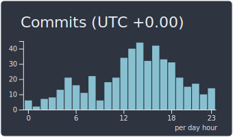

<!-- ================ HEADER ================ -->
# Hey, I'm Shivapreetham! 👋 

  

 

  

  
  
  
  

---

## 🌟 About Me
- 🎓 **CSE undergrad** @ NIT Jamshedpur (Class of ’27), CGPA 8.79  
- 🏆 **3rd Place**, HaXplore IIT‑BHU (2,300+ teams)  
- 🚀 **Top 10 Finalist**, Qualcomm Edge AI Hackathon (1,700+ participants)  
- 💡 Passionate about **scalable web apps**, **AI/ML**, and **system design**  

---
## 🚀 Technologies I've Worked With

### 💻 Languages

### 🧱 Libraries & Frameworks

### 🧠 AI/ML & Vision

### 🗄️ Databases & ORMs

### ☁️ Cloud & DevOps

### 🧰 Tools & IDEs

### 🌐 Markup & Core Stack

### 🖥️ OS & Shell

 

# Github stats

  
  
  
  

 

---

> “Code is like humor. When you have to explain it, it’s bad.” – Cory House

